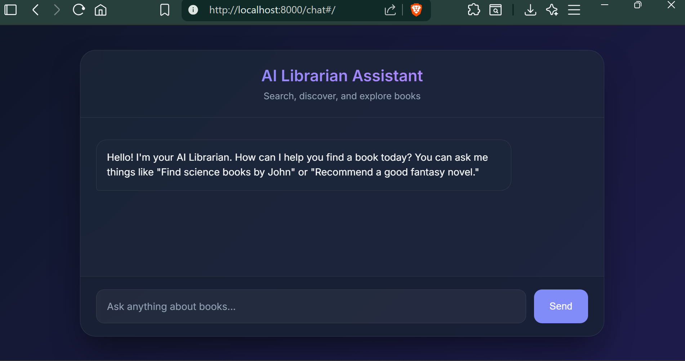
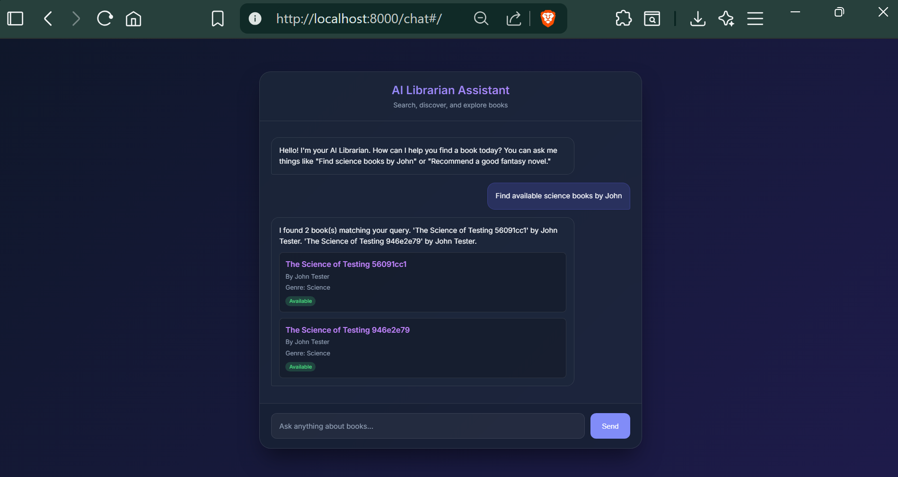
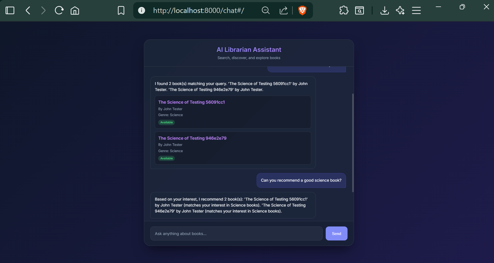
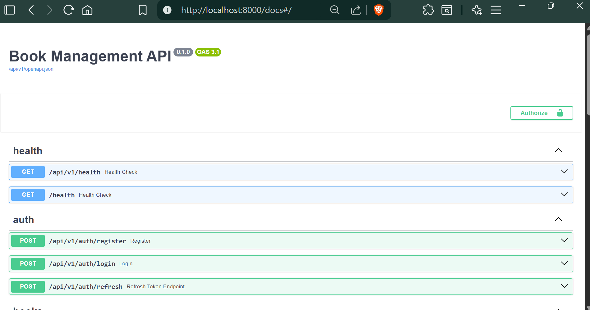
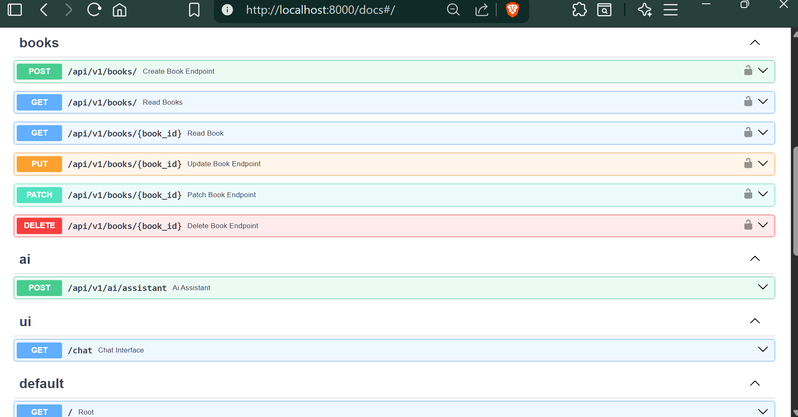
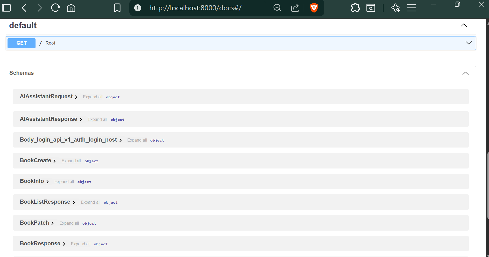
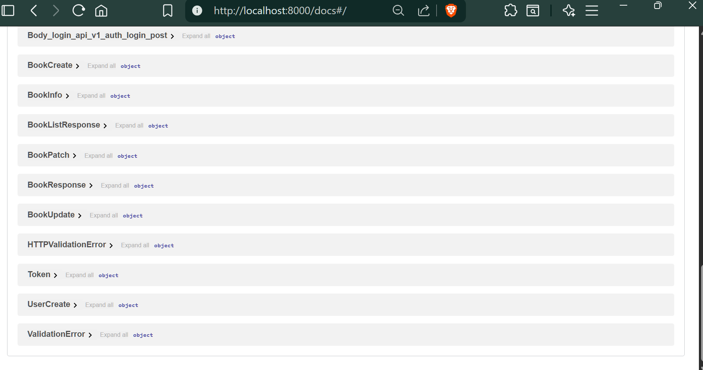

# 📚 Book Management System API & AI Librarian Assistant

A production-ready REST API for managing a Book Management System, built with **FastAPI** following modern software engineering best practices. This project goes above and beyond standard requirements by integrating an advanced **LangGraph-powered AI Librarian Assistant** with a stunning glassmorphism Web UI.

## 🌟 Project Overview

The Book Management API is designed to be organized, scalable, and highly maintainable. It supports full CRUD operations on books with robust validation, structured logging, and token-based authentication.

**Bonus Features Implemented:**
- ✅ **JWT Authentication** (Secure login and token refresh)
- ✅ **Request ID Middleware** (Traceability for structured logs)
- ✅ **Rate Limiting** (Protection against abuse using SlowAPI)
- ✅ **Database Migrations** (Managed schema changes using Alembic)
- ✅ **Redis Caching** (High-performance caching infrastructure)
- 🚀 **AI Chat Interface** (A LangGraph-based chatbot capable of intelligent natural language search!)

---

## 📸 Demo - Screenshots

### 🤖 AI Librarian Web Interface
| Before Query | Search Query | Complex Query |
| :---: | :---: | :---: |
|  |  |  |

### 📖 Built-in Swagger API Documentation
| Endpoints Overview | Authentication |
| :---: | :---: |
|  |  |
|  |  |

---

## 🛠️ Folder Structure

```text
book_api/
│
├── app/
│   ├── ai/              # LangGraph AI Assistant & Tools
│   ├── api/             # API Router endpoints (v1)
│   ├── core/            # Configuration and Security (JWT, bcrypt)
│   ├── database/        # Database session and setup
│   ├── exceptions/      # Global exception handlers
│   ├── middleware/      # Rate Limiting, Request ID, Logging
│   ├── models/          # SQLAlchemy ORM models
│   ├── repositories/    # Database queries and CRUD abstraction
│   ├── schemas/         # Pydantic validation models
│   ├── services/        # Business logic layer
│   ├── static/          # AI Chat Web UI assets (HTML/CSS/JS)
│   ├── utils/           # Helper utilities
│   └── main.py          # FastAPI application entry point
│
├── alembic/             # Database migration scripts
├── demo/                # Demo videos and screenshots
├── tests/               # Unit testing suite
│
├── Dockerfile           # Docker configuration for the API
├── docker-compose.yml   # Multi-container orchestration
├── requirements.txt     # Python dependencies
├── .env.example         # Environment variables template
├── alembic.ini          # Alembic configuration
├── verify_api.py        # End-to-End API verification script
└── README.md            # You are here!
```

---

## ⚙️ Environment Variables

The application is configured using environment variables. To run the project, create a `.env` file in the root directory (you can copy the provided `.env.example`).

```env
# Database
POSTGRES_SERVER=postgres
POSTGRES_USER=postgres
POSTGRES_PASSWORD=postgres
POSTGRES_DB=bookdb
POSTGRES_PORT=5432

# Security
SECRET_KEY=your_super_secret_key
ALGORITHM=HS256
ACCESS_TOKEN_EXPIRE_MINUTES=30

# AI Configuration
ENABLE_AI_ASSISTANT=True
OPENAI_API_KEY=your_openai_api_key_here
```

---

## 🚀 Installation & Running the Application

### Option A: Running with Docker (Recommended)
This is the easiest way to run the application, as it automatically spins up the API, PostgreSQL database, and Redis cache.

1. Ensure Docker and Docker Compose are installed.
2. Build and start the containers:
   ```bash
   docker compose up --build
   ```
3. The API will be available at `http://localhost:8000`
4. The AI Web UI will be available at `http://localhost:8000/chat`

### Option B: Running Locally (Without Docker)
1. Ensure you have Python 3.11+ and PostgreSQL installed.
2. Create and activate a virtual environment:
   ```bash
   python -m venv venv
   source venv/bin/activate  # On Windows use: venv\Scripts\activate
   ```
3. Install dependencies:
   ```bash
   pip install -r requirements.txt
   ```
4. Update your `.env` file to point to your local PostgreSQL instance (e.g., `POSTGRES_SERVER=localhost`).
5. Run the database migrations:
   ```bash
   alembic upgrade head
   ```
6. Start the FastAPI server:
   ```bash
   uvicorn app.main:app --reload --host 0.0.0.0 --port 8000
   ```

---

## 📡 API Endpoints

### 🔐 Authentication
- `POST /api/v1/auth/register` - Create a new user account
- `POST /api/v1/auth/login` - Authenticate and receive a JWT Access Token
- `POST /api/v1/auth/refresh` - Refresh an expired Access Token

### 📚 Books (Secured Routes)
- `POST /api/v1/books/` - Create a new book
- `GET /api/v1/books/` - Retrieve all books (Supports pagination, title, author, and genre filtering)
- `GET /api/v1/books/{id}` - Retrieve a single book by ID
- `PUT /api/v1/books/{id}` - Update an entire book record
- `PATCH /api/v1/books/{id}` - Partially update a book record
- `DELETE /api/v1/books/{id}` - Delete a book

### 🤖 AI Librarian Assistant
- `POST /api/v1/ai/assistant` - Submit a natural language query (e.g., *"Find available science books by John"*)
- `GET /chat` - Interactive Web UI for the AI Assistant

### 🩺 System
- `GET /health` - Health check status for API, Database, and Redis

---

## 🧪 Testing Instructions

The repository includes a comprehensive testing suite.

### 1. Automated Unit Tests
Run the test suite using `pytest`:
```bash
pytest
```
*(Tests cover CRUD operations on books, ensuring correct behavior and error handling).*

### 2. End-to-End API Verification
We have included a custom integration script that acts as an automated client, registering a user, logging in, creating a book, and querying the AI assistant.
Run it while the server is active:
```bash
python verify_api.py
```

### 3. Manual Testing via Swagger UI
1. Navigate to **[http://localhost:8000/docs](http://localhost:8000/docs)**
2. Create a user via `/auth/register`.
3. Click the **Authorize** button at the top right, and log in with your credentials.
4. You can now execute and test all secured book endpoints directly from your browser!